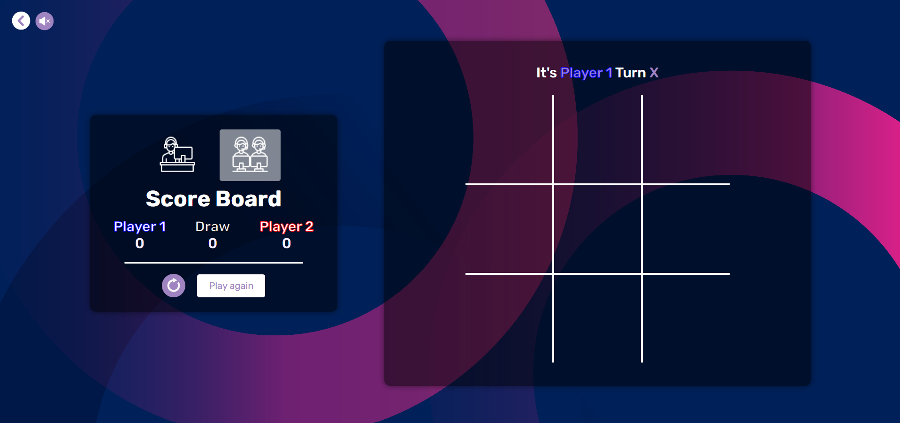

# Tic-Tac-Toe Game

This repository contains the code for a **Tic-Tac-Toe game**, developed as part of **TASK03** for the **Prodigy Infotech** internship. The game allows users to play against each other or against an AI, featuring a clean and interactive design.

## Features
- **Multiplayer Mode**: Play against a friend.
- **Single Player Mode**: Play against an AI opponent with difficulties.
- **Dynamic Board**: Responsive design adapting to different screen sizes.
- **Local Storage**: Player's symbol selections are stored and managed effectively.
- And more other other features to be discovered

## Technologies Used
- **HTML5**: For the structure of the game interface.
- **CSS3**: For styling and layout.
- **JavaScript**: For game logic and interactivity using DOM manipulation.
- **ReactJS**: For building reusable components and managing application state.

## Screenshots
Here are some screenshots from the game:
**Game Interface**


**Multiplayer Mode**



**Single Player Mode**


## Installation

1. Clone this repository:
   ```bash
   git clone https://github.com/moncefchelm18/PRODIGY_WD_03.git
2. Navigate to the project directory:
   ```bash
   cd tic-tac-toe
3. Open the index.html file in your browser or set up a local server to view the game.

## Demo
Check out the live version of this landing page [here](https://moncefchelm18.github.io/PRODIGY_WD_03/).

## Contact

If you have any questions or feedback, feel free to reach out via:

- **Email**: mounsif.chelgham@univ-constantine2.dz
- **Phone**: +213 562 189 015
- **LinkedIn**: [LinkedIn Profile](https://www.linkedin.com/in/mounsif-chelgham-b94202289/)
  
